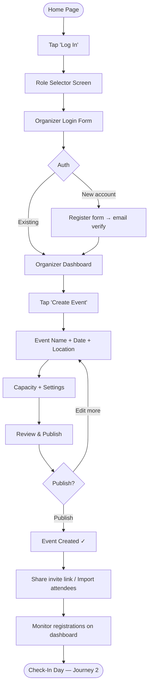
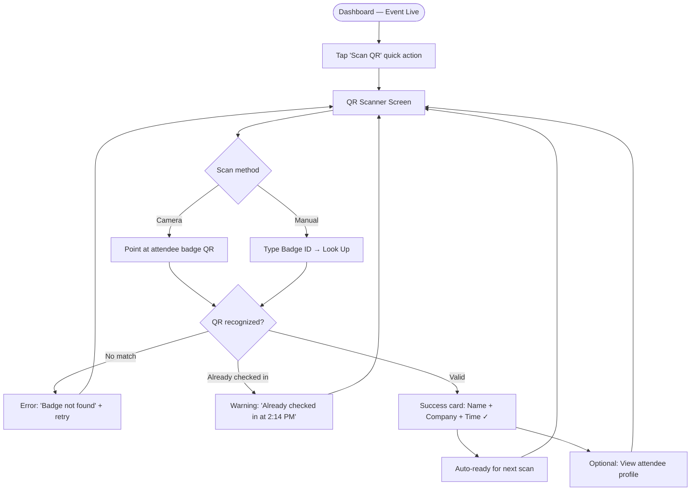
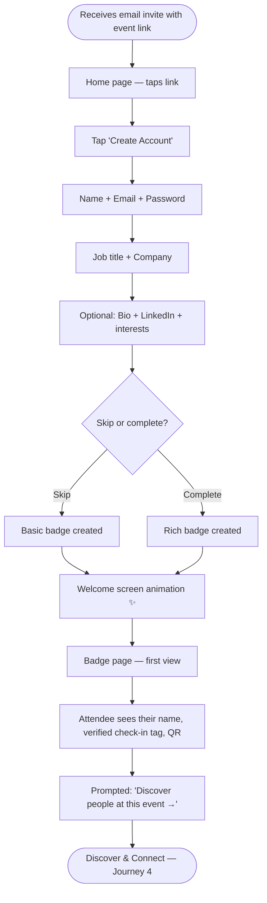
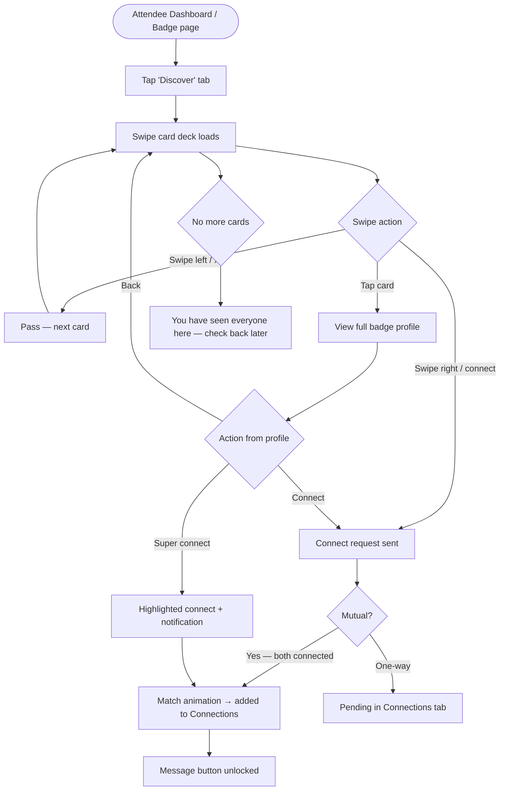
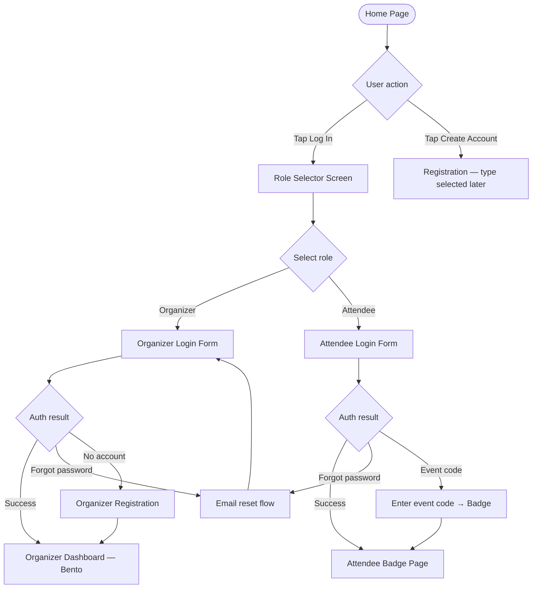

# UX Design Specification Conventionals

**Author:** XdJos
**Date:** 2026-04-07

---

<!-- UX design content will be appended sequentially through collaborative workflow steps -->

## Executive Summary

### Project Vision

Conventionals is a dual-audience event platform serving two distinct user roles under one roof: a back-office tool for organizers who need to run events efficiently, and a professional networking layer for attendees who want to meet the right people and remember who they met.

The application is fully built and functional. This UX design work is about leveling up the experience from "it works" to "it feels great" — establishing a design system foundation, addressing zero-state moments, and optimizing mobile-critical flows.

### Target Users

**Organizer** — A small event coordinator, meetup organizer, or conference admin. Task-focused, desktop-primary, measuring success by "did everyone get their badge." Needs data density, efficiency, and a clear flow from event creation to check-in day.

**Attendee** — A professional who received a badge email from an organizer. They did not sign up voluntarily — they were registered by someone else. Their first touchpoint is the badge email; their second is the invite link to create an account. If that moment feels unpolished or confusing, they bounce. If it feels welcoming, they explore the networking features. Mobile usage is high — QR check-in, badge display, and people-browsing all happen on a phone at the event.

### Key Design Challenges

1. **Dual-audience visual system** — Organizers need data density and efficiency; attendees need warmth and approachability. The current inline-CSS approach treats both audiences identically. A design system needs to serve both without feeling like two separate apps.

2. **Cold-start / zero-state moments** — When an organizer signs up to an empty dashboard, or when an attendee lands on the signup page from a badge email, there is no guidance. No empty states, no onboarding hints — these are the highest drop-off risk points in the current implementation.

3. **Mobile-critical screens** — QR check-in, badge display, and the attendee people-browse page are all used on mobile at live events. These screens were not built with a mobile-first mindset and need specific attention.

### Design Opportunities

1. **Dashboard as a command center** — The organizer dashboard currently renders a flat event list. A Bento Box Grid layout could make it visually scannable with at-a-glance stats, recent activity, and quick actions — matching the top UI style recommendation for SaaS dashboards.

2. **Attendee onboarding moment** — The invite → signup → profile → networking flow is a high-value retention hook. Immediately after signup, surfacing "You were at [Event] — here are other attendees you can connect with" could transform a passive badge-holder into an active networking user.

3. **Design system foundation** — The codebase uses per-file inline `CSSProperties` objects with no shared tokens. Establishing a consistent design system (spacing scale, color tokens, component patterns) would make every future feature faster to build and more visually consistent.

**Design Intelligence (UI UX Pro Max recommendations for Event Management SaaS):**
- Color: Purple primary `#7C3AED` + orange CTA `#F97316` ("excitement + action") — or maintain current indigo `#6366F1` with emerald CTA `#10B981`
- Typography: Plus Jakarta Sans (friendly modern SaaS) or Space Grotesk + DM Sans (tech startup)
- Layout: Bento Box Grid for dashboard; clean card hierarchy throughout

## Core User Experience

### Defining Experience

Conventionals runs two parallel core loops:

**Organizer Loop** — "Set up once, know who showed up." The organizer's primary job is getting attendees into the system and watching check-ins roll in on event day. Event creation and badge delivery are the setup; the live check-in dashboard is the payoff.

**Attendee Loop** — "Get in the door, find the right people, remember who I met." The attendee's journey starts with a QR code scan at the door and ends with a connection list they can reference after the event. The bridge between those two moments — the invite → signup flow — is the highest-stakes screen in the product.

### Platform Strategy

- **Organizers: Desktop-primary.** Event creation, CSV upload, attendee management, and dashboard analysis happen at a desk before and after the event.
- **Attendees: Mobile-first.** Badge display, QR check-in, people-browsing, and connecting all happen on a phone at the live event.
- **No offline requirement** — both platforms require connectivity, which is acceptable for the use case.

### Effortless Interactions

1. **QR check-in** — Point, scan, done. Sub-second response. No login required. Works on any phone camera. This is the most public-facing interaction in the product and must be flawless.
2. **One-tap connect** — "Connect" on the people page should be a single tap with immediate feedback. No forms, no friction.
3. **Badge email → account creation** — The invite link must work first try. The signup form should be minimal: password only (name and email already known from registration).
4. **CSV upload** — Drop file, get confirmation. Organizers should never have to think about format edge cases.

### Critical Success Moments

1. **The check-in scan** — When an attendee holds up their phone and the check-in confirms in under a second: success. The organizer sees it update live on their dashboard.
2. **The first connection** — When an attendee taps "Connect" and sees the person appear in their connections list immediately: the networking value proposition is proven.
3. **The empty dashboard moment** — When a brand-new organizer creates their first event and sees a clear next step ("Add your first attendees →"): they stay engaged instead of bouncing.
4. **The post-event follow-up** — When an attendee opens the app the day after the event and their connection list with notes is right there: the product has earned a repeat user.

### Experience Principles

1. **Speed is respect** — Every interaction that happens on-site (check-in, connect, badge display) must be instantaneous. People are standing in a line or mid-conversation. Every second of friction is a failure.
2. **Focus beats features** — Whova's downfall is complexity. Conventionals wins by being the tool that does less, but does it perfectly.
3. **Mobile-first for attendees, data-first for organizers** — Design decisions must reflect which audience is using which screen and in what context.
4. **The cold start must be warm** — Empty states are not empty boxes. They are the most important onboarding moment in the product. Every zero-state screen needs a clear, encouraging call-to-action.

## Desired Emotional Response

### Primary Emotional Goals

**Organizer:** *Calm confidence shading into energized control.* Before the event: "Everything is handled." On event day: "I can see exactly what's happening." The product should feel like having a capable assistant — never uncertain, never cluttered.

**Attendee:** *Welcomed, trusted, and socially confident.* From the first badge email to the last post-event connection, the attendee should feel like they've been handed something polished — not a generic registration tool, but an experience someone cared about building.

**Shared brand personality:** Professional, approachable, and trustworthy. The kind of person at the event who has everything sorted and makes everyone feel welcome. Particularly resonant for sales professionals — relationship-driven, impression-conscious, and sensitive to how tools reflect on them.

### Emotional Journey Mapping

| Moment | Target Emotion |
|---|---|
| Organizer: first event created | Accomplishment — "That was easy" |
| Organizer: badge emails confirmed sent | Relief + confidence — "Everyone's covered" |
| Organizer: event day, check-ins ticking up | Energized, in control |
| Attendee: badge email arrives | Pleasantly surprised — "This looks professional" |
| Attendee: signup page | Trusted — "I know who sent this, it feels legit" |
| Attendee: welcome message after signup | Welcomed — a warm moment, not a cold form confirmation |
| Attendee: first people browse | Curious, excited — "Oh, I can see who's here" |
| Attendee: first connect tap | Socially confident — the digital card exchange |
| Attendee: check-in confirmation | Delighted — a satisfying micro-moment |
| Attendee: post-event connections list | Glad they signed up — the product earned a return visit |

### Micro-Emotions

- **Confidence over confusion** — Every screen should make the next step obvious. No hunting.
- **Trust over skepticism** — Attendees didn't choose this app; the design must earn their trust fast. Clean, purposeful, no dark patterns.
- **Delight over mere satisfaction** — Three specific moments designed for delight, not just functional completion.
- **Belonging over isolation** — The people-browse and connections experience should feel warm and social, not cold and transactional.

### Delight Moments (Designed Intentionally)

Three specific screens where the experience should rise above functional:

1. **Badge page** (`/badge/[token]`) — The attendee's first visual impression of Conventionals. Large, bold QR code. Event name prominent. Clean, premium feel. On mobile this should look like something worth showing at the door — not a plain white page with a small QR image.

2. **Check-in confirmation** — After a successful QR scan, a satisfying micro-animation: a checkmark, a brief color flash, something that signals *success* with personality. Not just `{ checkedIn: true }` rendered as text.

3. **Welcome message after signup** — Immediately after account creation, a warm, personal-feeling screen: "Welcome, [Name]. You're all set for [Event]." Optionally surfacing "Here's who else is attending" as the first CTA — turning a form confirmation into a networking invitation.

### Design Implications

- **Professional but warm** → Indigo primary with approachable typography (Plus Jakarta Sans or Space Grotesk). Not cold enterprise blue. Not casual consumer pink.
- **Sales-person appeal** → The badge page and profile should make *them* look good. Sharp design, clean layout, LinkedIn-style profile cards on people-browse.
- **Delight through motion** → Subtle, purposeful animations on the three delight moments. Not decorative — emotionally meaningful.
- **Trust through clarity** → No hidden steps, no confusing navigation. Every zero-state has a clear next action. Error messages are helpful, not cryptic.

### Emotional Design Principles

1. **Make organizers feel capable, not technical** — The product handles complexity so they don't have to think about it.
2. **Make attendees feel chosen, not processed** — Even though they were bulk-uploaded from a CSV, the experience should feel personal.
3. **Earn the sales person's endorsement** — If the badge page looks impressive and check-in is smooth, the organizer becomes an advocate. Their attendees become leads for future events.
4. **Delight is earned, not decorative** — Animation and visual flourish only appear at moments of genuine user success. Elsewhere: clarity and speed.

## UX Pattern Analysis & Inspiration

### Inspiring Products Analysis

**Luma** — *The benchmark for effortless organizer flow*
Beautiful event pages created in minutes, QR check-in built in, clean mobile experience. Their secret: every step feels like a consumer app, not enterprise software. Fast, opinionated, never overwhelming. Directly applicable to Conventionals' organizer onboarding and event creation flow.

**Grip / Whova (swipe-to-match networking)** — *The engagement model to beat*
The Tinder-style swipe mechanic for attendee matching is the most compelling networking UX in the events space. It converts passive browsing into active decision-making — you're not scrolling a list, you're playing a game. Each swipe is a micro-commitment that keeps attendees in the app during the event. Key insight: **engagement comes from decision-making, not reading.**

**Stripe Dashboard** — *Data that feels alive*
Real-time numbers, clean hierarchy, stats that update and pulse. Organizers on event day want this feeling — check-ins ticking up, percentages filling in. The emotional payoff of a well-designed live dashboard is massive.

**LinkedIn** — *The professional trust layer*
Profile cards, mutual connections, shared event context. The people-browse page should feel instantly familiar to a sales professional — name, company, title, and a clear action button. No learning curve.

**Linear** — *Focus over features*
Every screen has exactly one primary action. Navigation is invisible until needed. The counter-model to Whova's complexity problem. Conventionals should feel this focused on each individual screen.

### Transferable UX Patterns

**Navigation Patterns:**
- **Single primary action per screen** (Linear) — every page has one obvious next step, never competing CTAs
- **Sticky bottom action bar on mobile** (Luma, LinkedIn) — on attendee mobile screens, the primary action (Connect, Check In) is a fixed bottom button, always reachable with a thumb

**Interaction Patterns:**
- **Swipe/card-deck discovery mode** (Grip/Whova) — people-browse becomes a swipeable card deck on mobile. Each card shows name, company, role, and two actions: Connect / Skip. 3–5x more connections than list browsing.
- **Live counter animation** (Stripe) — check-in numbers visually increment as they update on the organizer dashboard. Small motion, massive emotional impact.
- **One-tap connect with undo** (LinkedIn) — connect is instant, with a brief "Connected! Undo?" toast. No confirmation modal.
- **Post-action nudge** (Luma, Superhuman) — after every success (signup, connection made), nudge toward the next valuable action. Never leave users at a dead end.

**Visual Patterns:**
- **Dimensional card elevation** — profile cards use subtle shadow layering to feel tactile and swipeable, not flat and list-like
- **Bento Box Grid for organizer dashboard** — varied card sizes for stats, recent activity, quick actions. Scannable at a glance.
- **Progress indicators on multi-step flows** — signup, profile completion, event setup. Show users where they are and what's left.

### Anti-Patterns to Avoid

- **The Whova trap: feature overload** — too many tabs, too many notification types, too much competing for attention. Every feature must earn its screen real estate.
- **Flat list browsing for people** — a scrollable list of names is the least engaging way to present networking. Cards with identity signals are the minimum; swipe mode is the ceiling.
- **Dead-end confirmation screens** — "You're registered!" with no next step is a missed retention moment. Every completion screen is an onboarding opportunity.
- **Generic empty states** — blank dashboard or empty connections list with no guidance is the highest drop-off point. Every zero-state needs a specific, encouraging CTA.
- **Desktop-first mobile layouts** — shrinking a desktop layout onto mobile doesn't work for on-site use cases. Badge page, check-in, and people-browse must be designed mobile-first.

### Design Inspiration Strategy

**Adopt directly:**
- Swipe/card-deck interaction model for people-browse (mobile)
- Luma's "beautiful and fast" organizer creation flow ethos
- LinkedIn's profile card visual language — immediately trusted by sales professionals
- Stripe's live-updating dashboard feel for organizer event day

**Adapt for Conventionals:**
- Swipe mechanic simplified — no algorithm, no mutual interest required. Card-by-card connect/skip decisions. Simpler than Grip, still dramatically more engaging than a list.
- Bento Grid dashboard — adapted to Conventionals data: check-in rate, emails sent, attendee count as hero stats

**Avoid entirely:**
- Notification-heavy engagement loops (Whova's mistake)
- Feature tabs that require discovery — navigation must be obvious
- Any pattern that requires users to read instructions

## Design System Foundation

### Design System Choice

**shadcn/ui + Tailwind CSS** — the modern Next.js sweet spot.

shadcn/ui provides beautiful, accessible, composable components that live directly in the codebase (not a locked dependency). Tailwind CSS provides a complete design token system: color palette, spacing scale, border radius, shadows, and typography — all configurable in one place.

### Rationale for Selection

- **Next.js 16 App Router native** — shadcn is built for the App Router. Zero adapter friction.
- **You own the components** — all components live in `components/ui/`. Customize freely without library updates breaking the UI.
- **Replaces scattered inline styles** — the current per-file `CSSProperties` approach has no shared tokens. Tailwind config becomes the single source of truth for color, spacing, and radius. One change propagates everywhere.
- **Swipe card deck is buildable** — shadcn Card + `framer-motion` enables the Tinder-style people-browse without building from scratch.
- **Delight moments are natively supported** — `framer-motion` pairs naturally with shadcn for the check-in animation, welcome screen transition, and badge page entrance.
- **Professional visual quality ceiling** — unlike MUI/Chakra, shadcn's default aesthetic is modern, clean, and brand-neutral. Looks sharp to sales professionals out of the box.

### Implementation Approach

**Incremental migration — high-visibility screens first:**

1. Install Tailwind CSS + shadcn/ui into `conventionals/`
2. Define design tokens in `tailwind.config.ts` (colors, spacing, radius, shadows)
3. Migrate delight-moment screens first: badge page, signup welcome, check-in confirmation
4. Migrate organizer dashboard to Bento Grid layout
5. Build swipe card deck for attendee people-browse
6. Incrementally replace remaining inline-styled components

### Customization Strategy

**Color tokens (Tailwind config):**
- `primary`: `#6366F1` (current indigo — maintain brand continuity)
- `primary-dark`: `#4f46e5`
- `accent`: `#10B981` (emerald CTA — replaces current indigo for actions)
- `background`: `#F9FAFB`
- `surface`: `#FFFFFF`
- `text-primary`: `#111827`
- `text-secondary`: `#6B7280`

**Typography:** Plus Jakarta Sans (Google Fonts) — friendly, modern SaaS. Replaces current Geist Sans for body text. Keep Geist Mono for data/badge token display.

**Border radius scale:** `rounded-xl` (16px) for cards, `rounded-lg` (8px) for inputs/buttons — consistent across all components.

**Elevation scale (4 levels):**
- Level 1: `shadow-sm` — input fields, subtle containers
- Level 2: `shadow-md` — cards, panels
- Level 3: `shadow-lg` — modals, profile cards on people-browse
- Level 4: `shadow-xl` — badge page QR card, swipe deck top card

**Motion library:** `framer-motion` — used exclusively on the three delight moments (check-in confirmation, signup welcome, badge page entrance) and the swipe card interaction. Not decorative elsewhere.

## Defining Core Experience

### 2.1 Defining Experience

> *"The event platform where organizers set it up in minutes and attendees actually want to use the app."*

Conventionals' defining experience is the **bridge** — the moment the two user journeys connect. An organizer uploads a CSV, badges go out, and without any extra work on their part, their attendees have a reason to open the app, create a profile, and start networking. The organizer looks good. The attendees get value. The platform earns both.

This is the differentiation that kills every "boring registration tool" competitor: attendees don't just *receive* from Conventionals, they *participate* in it.

### 2.2 User Mental Models

**Organizer mental model:** *"Event tool = admin work."* They expect friction, spreadsheets, and manual follow-up. Conventionals should feel like it's doing work *for* them — badge emails go out automatically, the check-in app is already built, the networking layer requires zero setup. Every moment that saves them a step reinforces the mental model shift: *"This thing handles itself."*

**Attendee mental model:** *"Registration email = ignore or delete."* They've seen a hundred generic confirmation emails. The badge email must visually interrupt that pattern — polished design, a QR code that actually works, and an invite that feels worth clicking. The mental model to implant: *"This is the app for this event — and it's actually good."*

### 2.3 Success Criteria

**For the organizer:**
- Event created, CSV uploaded, and all badge emails confirmed sent in under 5 minutes
- On event day: check-in dashboard loads immediately, updates in real time, no refresh needed
- Zero support questions from attendees about how to check in

**For the attendee:**
- Badge email opens on mobile, QR code immediately visible and scannable without zooming
- Signup takes under 60 seconds (password only — name/email pre-filled)
- Within 30 seconds of signup, they see at least one person they could connect with
- Post-event: connections list with notes is the first thing they see on return

**The bridge success metric:**
- An attendee who connected with ≥1 person is a retained user
- An organizer whose attendees *used* the app (not just checked in) will use Conventionals again

### 2.4 Novel vs. Established Patterns

**Established patterns (zero learning curve):**
- QR code check-in — universally understood
- Profile card + connect button — LinkedIn mental model
- Badge email with name and QR — every conference does this

**Novel combination (Conventionals' edge):**
- **Swipe-to-connect at the event** — familiar Tinder mechanic, new context. Attendees already know how to swipe. The novelty is *why* — meeting people at the event they're currently at. No teaching needed because the gesture is already learned.
- **The seamless invite → network bridge** — most platforms stop at check-in. Conventionals uses that moment as the entry point to networking. The badge and the social graph are the same product.

**Teaching strategy for novel patterns:**
- Swipe deck: first card shows a subtle "← Skip · Connect →" hint that disappears after first use
- Welcome screen post-signup: one sentence — "Swipe through attendees to connect with people at this event."

### 2.5 Experience Mechanics

**The organizer's core flow:**

| Step | Interaction | System Response |
|---|---|---|
| 1. Initiation | Clicks "New Event" on empty dashboard | Modal/drawer slides in with name + date fields |
| 2. Setup | Types event name, picks date, clicks Create | Event appears on dashboard immediately |
| 3. Upload | Drops CSV onto upload zone or clicks to browse | Progress bar, then "24 attendees added, 0 skipped" |
| 4. Confirmation | Sees attendee list with email-sent checkmarks | Green badges animate in as emails confirm sent |
| 5. Event day | Opens dashboard, watches check-in counter live | Number increments with subtle count-up animation |

**The attendee's core flow:**

| Step | Interaction | System Response |
|---|---|---|
| 1. Badge email | Opens email on phone | Large QR code visible above fold, no scrolling needed |
| 2. Check-in | Staff scans QR | Attendee's phone shows check-in confirmation with animation |
| 3. Invite click | Taps "Set up your account" | Signup page: name/email pre-filled, password field only |
| 4. Welcome | Submits password | Welcome screen: "Hi [Name], you're in. Here's who's here →" |
| 5. Discovery | Swipe deck of attendee cards | Swipe right = connect (instant), swipe left = skip |
| 6. Post-event | Returns to app next day | Connections list with notes, sorted by most recent |

## Visual Design Foundation

### Color System

Built on the existing indigo brand color — extended with semantic tokens and an emerald accent for actions.

| Token | Value | Usage |
|---|---|---|
| `primary` | `#6366F1` | Brand color, nav, links, active states |
| `primary-dark` | `#4F46E5` | Hover states, pressed buttons |
| `primary-light` | `#EEF2FF` | Backgrounds, badges, highlight states |
| `accent` | `#10B981` | CTAs, success states, Connect button |
| `accent-dark` | `#059669` | Accent hover |
| `destructive` | `#EF4444` | Errors, delete actions |
| `warning` | `#F59E0B` | Caution states |
| `background` | `#F9FAFB` | Page background |
| `surface` | `#FFFFFF` | Cards, panels, modals |
| `surface-muted` | `#F3F4F6` | Subtle section backgrounds |
| `text-primary` | `#111827` | Headings, primary content |
| `text-secondary` | `#6B7280` | Labels, meta text, placeholders |
| `text-tertiary` | `#9CA3AF` | Hints, disabled states |
| `border` | `#E5E7EB` | Card borders, dividers, inputs |

All color pairs meet WCAG AA contrast (4.5:1 minimum). Primary on white: 4.6:1 ✓

### Typography System

**Primary font:** Plus Jakarta Sans (Google Fonts) — replaces Geist Sans for all UI text. Friendly, modern SaaS tone.
**Data/token display:** Geist Mono retained for badge tokens, technical strings.

| Role | Font | Weight | Size |
|---|---|---|---|
| Display / Hero | Plus Jakarta Sans | 700 | 2.5–3rem |
| Heading H1 | Plus Jakarta Sans | 700 | 1.875rem |
| Heading H2 | Plus Jakarta Sans | 600 | 1.5rem |
| Heading H3 | Plus Jakarta Sans | 600 | 1.25rem |
| Body | Plus Jakarta Sans | 400 | 1rem (16px) |
| Body small | Plus Jakarta Sans | 400 | 0.875rem |
| Label / Badge | Plus Jakarta Sans | 500 | 0.75rem |
| Data / Token | Geist Mono | 400 | 0.875rem |

Line height: 1.5 for body, 1.2 for headings.

### Spacing & Layout Foundation

**Base unit:** 8px. All spacing uses multiples of 4px.

| Token | Value | Usage |
|---|---|---|
| `space-1` | 4px | Tight grouping |
| `space-2` | 8px | Component padding S |
| `space-4` | 16px | Component padding M, card inner |
| `space-6` | 24px | Section spacing S, card outer |
| `space-8` | 32px | Section spacing M |
| `space-12` | 48px | Section spacing L |
| `space-16` | 64px | Hero/page sections |

**Layout:**
- Page max-width: 1200px, centered
- Content max-width: 800px (single-column)
- Dashboard grid: 12-column, 24px gap
- Card padding: 24px desktop / 16px mobile
- Mobile breakpoint: 640px — all attendee screens designed mobile-first at 375px

**Border radius:**
- Cards: `rounded-2xl` (16px)
- Inputs/buttons: `rounded-xl` (12px)
- Badges/avatars: `rounded-full`

**Elevation scale:**
- Level 1 `shadow-sm`: Input fields, subtle containers
- Level 2 `shadow-md`: Cards, panels
- Level 3 `shadow-lg`: Profile cards on people-browse, modals
- Level 4 `shadow-xl`: Badge page QR card, swipe deck top card

### Accessibility Considerations

- All text/background color pairs meet WCAG AA (4.5:1 for normal text, 3:1 for large text)
- Focus states: visible `ring-2 ring-primary ring-offset-2` on all interactive elements
- Touch targets: minimum 44×44px on all mobile interactive elements (critical for swipe deck and check-in screen)
- Motion: `framer-motion` animations respect `prefers-reduced-motion` — all transitions have a no-motion fallback
- Font sizes: minimum 14px for all readable text, 16px default body (prevents iOS zoom on input focus)

## Design Direction Decision

### Design Directions Explored

Six directions were explored: Clean Minimal, Bento Dashboard, Warm Professional, Dark Premium, Swipe Social, and Gradient Bold. Each was evaluated against Conventionals' brand personality (professional, approachable, trustworthy, sales-audience-focused) and mobile-first requirements.

An interactive HTML showcase was generated at `_bmad-output/planning-artifacts/ux-design-directions.html` showing all six directions across organizer and attendee screens.

### Chosen Direction

**"Bento Social"** — a combined direction merging Bento Dashboard and Swipe Social, with the following specifics:

- **No dark mode** — the product remains light and approachable throughout
- **Bento Dashboard as the organizer baseline** — modular, data-rich grid tiles showing live event stats (check-ins, registrations, connections, upcoming sessions) with quick-action shortcuts including QR check-in
- **Swipe Social as a separate Attendee tab** — Tinder-style card deck for discovering and connecting with other attendees, alongside Connections and Schedule tabs
- **Consistent hamburger menu** — slide-out drawer navigation used across both organizer and attendee experiences for mobile-first consistency
- **QR Check-In for organizers** — dedicated scanner screen with camera viewport, animated scan line, recent check-in history, and manual badge ID fallback
- **Home page** — landing with Login + Register CTAs, social proof stats, and product tagline
- **Role-aware login flow** — tapping Login prompts role selection (Organizer vs. Attendee) before routing to the correct login form
- **Digital badge** — gradient card with attendee photo/initials, verified check-in badge, QR code, social links, and connect/share actions; retained as a core delight moment

### Design Rationale

The Bento grid gives organizers a command-center feel — everything visible at a glance without needing to navigate, which suits busy event staff. The Swipe Social tab keeps the attendee experience engaging and non-transactional, addressing the concern that the product should not feel "bland or one dimensional." The role-split login prevents confusion and sets the right context before the user sees their first screen. The hamburger drawer maintains visual consistency between both user types while keeping the primary viewport uncluttered on mobile. The badge page is a deliberate delight moment — the first thing an attendee sees after check-in, designed to feel premium and shareable.

### Implementation Approach

- Organizer dashboard built as a responsive bento grid (2-column on mobile, expands on tablet/desktop)
- Swipe card deck implemented with framer-motion drag gestures and directional detection
- QR scanner uses the browser's `getUserMedia` camera API with a canvas-based QR decoder
- Hamburger drawer as a shared layout component used by both `(organizer)` and `(attendee)` route groups
- Role selector on login as a pre-auth screen before the actual credential form
- All screens mobile-first (375px base), progressively enhanced for larger viewports

## User Journey Flows

### Journey 1: Organizer — Event Setup to Go Live

**Goal:** Organizer creates and configures an event, invites attendees, and is ready for check-in day.

**Delight moments:** Published confirmation with shareable link, live registration counter on dashboard.

### Journey 2: Organizer — Check-In Day (QR Scanner)

**Goal:** Organizer efficiently checks in attendees at the door using QR scanner.

**Delight moments:** Instant green success card, recent check-ins list builds satisfaction throughout the day.

### Journey 3: Attendee — First-Time Onboarding (The Delight Moment)

**Goal:** Attendee receives invite, creates account, and experiences their badge for the first time.

**Delight moments:** Welcome animation after signup, badge page as the "wow" first screen, verified check-in badge appears when organizer scans them.

### Journey 4: Attendee — Discover & Connect (Swipe)

**Goal:** Attendee browses other attendees via swipe deck and makes a connection.

**Delight moments:** Match animation on mutual connect, match count visible on Connections tab badge.

### Journey 5: Both — Login / Role Selector Flow

**Goal:** Any user arrives at home page and reaches their correct dashboard in 3 taps or fewer.

### Journey Patterns

**Navigation patterns:**
- Hamburger drawer is the single source of navigation on all screens — no bottom tab bar
- Back arrows always return one level; never drop the user to home
- Role context (organizer vs. attendee) is set at login and persists in session

**Decision patterns:**
- Binary choices (skip/complete, connect/pass) always have a clear default or escape
- Destructive actions (remove connection, cancel event) require a confirmation step
- Error states always explain what happened and provide a single clear next action

**Feedback patterns:**
- Success states use green + checkmark + brief animation (check-in card, match animation)
- Progress states use subtle loaders, not blocking spinners
- Empty states include a clear CTA — never just "nothing here yet"

### Flow Optimization Principles

- **≤3 taps to value** — any critical action (check-in, connect, view badge) reachable in 3 taps from login
- **Optimistic UI** — connections and check-ins feel instant; errors surface after, not before
- **No dead ends** — every error screen has a retry or escape path
- **Mobile-first tap zones** — all primary actions sit in the bottom 60% of the screen (thumb reach on mobile)
- **Progressive disclosure** — attendee profile completion is optional at signup; nudged later via badge completeness indicator

## Component Strategy

### Design System Components (shadcn/ui — available out of the box)

| Component | Used For |
|---|---|
| `Button` | All CTAs, form submits, quick actions |
| `Input` / `Label` | Login forms, event creation, profile editing |
| `Card` | Bento grid tiles, attendee list rows |
| `Badge` | Status tags (Checked In, Registered, Live) |
| `Avatar` | Attendee initials in lists, drawer, scanner |
| `Dialog` / `Sheet` | Confirmation dialogs, modals |
| `Tabs` | Attendee Discover / Connections / Schedule |
| `Separator` | Form section dividers, nav dividers |
| `Toast` | Success/error notifications |
| `Skeleton` | Loading states for cards and lists |
| `Progress` | Check-in progress bar in bento tiles |
| `ScrollArea` | Attendee lists, connection lists |

### Custom Components

#### HamburgerDrawer
- **Purpose:** Primary navigation for both organizer and attendee; slide-in from left
- **Anatomy:** Overlay backdrop + drawer panel (logo, user info, nav sections, items)
- **States:** Closed (default), Open (slides in), Item hover, Item active
- **Variants:** Organizer (indigo active color) / Attendee (emerald active color)
- **Accessibility:** `role="dialog"`, `aria-label="Navigation menu"`, focus trap when open, `Escape` closes
- **Interaction:** Hamburger button triggers open; backdrop or close button dismisses

#### BentoCard
- **Purpose:** Modular stat/data tile for the organizer dashboard grid
- **Anatomy:** Icon row (icon + trend badge) + label + large number + subtitle + optional chart/progress
- **States:** Default, Loading (skeleton), Error
- **Variants:** `default` (white), `primary` (indigo gradient), `accent` (emerald gradient), `wide` (spans 2 columns)
- **Accessibility:** `aria-label` on trend badges describing the change context
- **Interaction:** Tappable variant navigates to detail view

#### SwipeCard / SwipeDeck
- **Purpose:** Tinder-style card deck for attendee discovery
- **Anatomy:** Card stack (3 visible, top active) + header (avatar, name, title, company) + body (tags, bio) + action buttons
- **States:** Idle, Dragging-left (red tint overlay), Dragging-right (green tint overlay), Swiped-off, Empty deck
- **Accessibility:** Button fallback for keyboard; `aria-label="Connect with [name]"`, `aria-label="Pass"`
- **Interaction:** framer-motion drag with velocity threshold; button fallback

#### BadgeCard
- **Purpose:** The digital attendee badge — core identity and delight component
- **Anatomy:** Gradient header (event name, avatar, name, title, company) + body (tags, bio, social links, QR, actions)
- **States:** Own badge (edit + share), Viewed badge (message + connect), Post-check-in (verified badge appears)
- **Variants:** `self` (indigo gradient) / `other` (profile-derived gradient, connect CTA)
- **Accessibility:** QR has `aria-label="Badge QR code for [name]"`, all actions labeled

#### QRScannerView
- **Purpose:** Camera viewport with scan-line animation for organizer check-in
- **Anatomy:** Dark viewport + 4 corner brackets + animated scan line + hint text
- **States:** Initializing, Ready (scan line animating), Success (green flash), Error (red flash), Already-checked-in (amber)
- **Accessibility:** `aria-live="polite"` region announces success/error states
- **Interaction:** `getUserMedia` camera API; auto-detects QR per frame via canvas; manual fallback input

#### RoleSelector
- **Purpose:** Pre-login screen where user picks Organizer or Attendee
- **Anatomy:** Back button + headline + two role cards (icon, title, description, arrow CTA)
- **States:** Default, Selected (card highlighted)
- **Accessibility:** `role="radiogroup"`, each card is `role="radio"`, `aria-checked` reflects selection

#### CheckInSuccessCard
- **Purpose:** Full-width success confirmation after a valid QR scan
- **Anatomy:** Green gradient bg + check icon + attendee name + company + time
- **States:** Shown for ~2.5s then auto-dismisses to scanner; tap to view full profile
- **Accessibility:** `aria-live="assertive"` announces check-in immediately

#### WelcomeAnimation
- **Purpose:** First-time attendee delight moment immediately after account creation
- **Anatomy:** Full-screen overlay + animated confetti/sparkle + "Welcome to [Event]!" + attendee name + fade to badge page
- **States:** Playing (3s) → auto-transitions to badge page
- **Accessibility:** Respects `prefers-reduced-motion` — falls back to instant fade

### Component Implementation Strategy

- All custom components built using Tailwind design tokens — no hardcoded colors
- shadcn/ui primitives (Dialog, Sheet, Button) used internally where possible
- framer-motion handles all animations (SwipeDeck drag, WelcomeAnimation, drawer slide)
- Components organized in `conventionals/components/` by domain: `organizer/`, `attendee/`, `shared/`
- Each component exports typed props; no prop-drilling beyond 2 levels

### Implementation Roadmap

**Phase 1 — Core (required for MVP flows):**
- `HamburgerDrawer` — blocks all navigation
- `RoleSelector` — blocks login flow
- `BadgeCard` — the primary delight screen
- `QRScannerView` — blocks check-in day flow
- `CheckInSuccessCard` — pairs with scanner

**Phase 2 — Engagement:**
- `SwipeCard` / `SwipeDeck` — attendee discovery
- `BentoCard` — organizer dashboard
- `WelcomeAnimation` — first-time onboarding moment

**Phase 3 — Polish:**
- Empty state illustrations for zero-connection and zero-attendee states
- Badge completeness indicator (nudge to fill profile)
- Micro-interaction refinements (swipe physics, card spring)

## UX Consistency Patterns

### Button Hierarchy

Three levels used consistently across all screens:

| Level | Style | When to Use |
|---|---|---|
| **Primary** | Indigo gradient, white text, shadow | One per screen — the single most important action |
| **Secondary** | White bg, indigo border + text | Supporting action alongside a primary |
| **Ghost** | No border, muted text | Low-priority or destructive (Skip, Cancel) |
| **Danger** | Red tint, confirmation dialogs only | Delete / remove actions |

Rules:
- Never two primary buttons on the same screen
- Destructive actions always ghost or danger — never primary
- All buttons minimum `h-11` (44px) on mobile for touch target compliance
- Loading state replaces label with spinner + disabled opacity — never remove the button

### Feedback Patterns

- **Success:** Green toast (`bg-emerald-500`) + checkmark, auto-dismisses after 3s. Check-in uses `CheckInSuccessCard` instead of toast.
- **Error:** Red toast, persists until dismissed. Form errors appear inline below the field — never replace the field value.
- **Warning:** Amber toast for non-blocking issues (e.g., "Already checked in").
- **Info:** Indigo toast for neutral updates (e.g., "Invite link copied").
- **Loading:** Skeleton placeholders matching layout shape — never a full-page spinner. Button loading state: spinner replaces label, button disabled.
- **Empty states:** Always icon + one-line explanation + single CTA. Never "No results found" without a next action.

### Form Patterns

- **Input states:** Default (`border-slate-200 bg-slate-50`), Focus (`border-indigo-500 ring-2 ring-indigo-100`), Error (`border-red-400 bg-red-50` + inline message), Disabled (`opacity-50 cursor-not-allowed`)
- **Validation:** On blur only — not on every keystroke. Never block submission with client-side errors that could be server-resolved.
- **Labels:** Always above the input, never placeholder-only. Optional fields labeled "(optional)" — no asterisks for required.
- **Layout:** Single column on mobile always. Full-width submit button on mobile, auto-width on desktop.
- **Multi-step forms:** Progress indicator at top; each step validates before advancing; back button always available.

### Navigation Patterns

- Hamburger drawer is the sole navigation mechanism — no bottom tab bar
- Drawer opens from left (280px wide), backdrop overlays remaining screen — tap to close
- Active drawer item: `bg-indigo-50 text-indigo-600` (organizer) or `bg-emerald-50 text-emerald-600` (attendee)
- In-page tabs (Discover / Connections / Schedule): pill style inside `bg-slate-100` container; active tab has `bg-white shadow-sm`
- Back arrows always visible at depth > 1; back never jumps to home unexpectedly

### Modal and Overlay Patterns

- Confirmation dialogs (destructive only): shadcn `Dialog` with "Cancel" (ghost) + "Confirm" (danger). Never `browser.confirm()`.
- Bottom sheet: shadcn `Sheet` from bottom for contextual actions without full navigation (share badge, quick attendee view).
- All overlays close on: backdrop tap, `Escape` key, explicit cancel button.

### Empty States and Loading States

**Skeleton rules:** Bento cards → rectangular skeleton; attendee rows → avatar circle + two text lines; swipe deck → single card shimmer. All use `animate-pulse`.

**Empty state structure:**
- 48px icon (slate-300)
- Primary message (slate-700, font-semibold)
- Optional secondary message (slate-400)
- Single CTA button

Key examples:
- No attendees registered → "No attendees yet" + "Share your event link"
- No connections → "Start discovering people" + "Go to Discover →"
- No events (organizer) → "Create your first event" + "Create Event" button

## Responsive Design & Accessibility

### Responsive Strategy

**Mobile (375px–767px) — Primary target, designed first:**
- Single-column layouts throughout
- Hamburger drawer navigation
- Full-width buttons, cards, and inputs
- Bento grid: 2-column max on mobile
- Swipe deck optimized for one-handed thumb use
- Minimum 16px font on all inputs (prevents iOS auto-zoom)
- All critical actions in the bottom 60% of screen (thumb zone)

**Tablet (768px–1023px) — Enhanced mobile:**
- Layout largely mirrors mobile; event apps are used on phones, not tablets
- Bento grid expands to 3-column
- Drawer can persist as sidebar at 768px+
- Swipe deck cards max 420px wide

**Desktop (1024px+) — Organizer-focused enhancement:**
- Persistent left sidebar replaces hamburger drawer for organizers
- Bento grid: 4-column with larger tiles
- Content max-width: 1280px, centered
- Attendee swipe experience stays phone-width (480px max) centered on screen
- Event management forms use 2-column layout where logical

### Breakpoint Strategy

Using Tailwind's default scale, mobile-first:

| Breakpoint | Prefix | Width | Layout change |
|---|---|---|---|
| Mobile | (none) | 0px+ | Single column, hamburger, 2-col bento |
| Small | `sm:` | 640px+ | Form width caps at 480px |
| Medium | `md:` | 768px+ | 3-col bento, optional persistent sidebar |
| Large | `lg:` | 1024px+ | 4-col bento, persistent sidebar, 2-col forms |
| XL | `xl:` | 1280px+ | Content max-width enforced |

### Accessibility Strategy

**Target: WCAG 2.1 Level AA**

**Color contrast (all pass AA):**
- `slate-700` on white: 8.9:1
- `slate-500` on white: 4.6:1
- White on indigo-500: 4.5:1
- White on emerald-500: 4.5:1
- Minimum font size: 14px throughout

**Keyboard navigation:**
- All interactive elements reachable via `Tab` in logical DOM order
- Focus indicator: `ring-2 ring-indigo-500 ring-offset-2` on all focusable elements
- `HamburgerDrawer`: focus trap when open, `Escape` closes, focus returns to trigger on close
- `SwipeDeck`: arrow keys navigate cards, `Enter` connects, `Delete` passes
- `QRScannerView`: manual input field is the keyboard-accessible fallback

**Screen reader support:**
- Semantic HTML: `<nav>`, `<main>`, `<section>`, `<button>` — never `
`
- `aria-live="polite"` on toast notifications and scanner status
- `aria-live="assertive"` on `CheckInSuccessCard` (time-sensitive)
- `aria-label` on all icon-only buttons (hamburger, close, notification bell)
- `role="radiogroup"` + `role="radio"` + `aria-checked` on `RoleSelector`

**Touch and motor:**
- All tap targets minimum 44×44px (`min-h-11 min-w-11`)
- Swipe deck has button alternatives — no gesture-only interactions
- Minimum 8px gap between adjacent tap targets

**Motion sensitivity:**
- All framer-motion animations use `useReducedMotion()` hook
- `WelcomeAnimation`: instant fade when `prefers-reduced-motion` is set
- Drawer: instant show/hide instead of slide when reduced motion is active

### Testing Strategy

- **Responsive:** Chrome DevTools simulation + real device testing on iOS Safari + Android Chrome
- **Accessibility:** `axe-core` or `eslint-plugin-jsx-a11y` in CI; VoiceOver (iOS/macOS) for screen reader; keyboard-only navigation walkthrough before major releases
- **Performance:** Lighthouse mobile score target 90+; Next.js `<Image>` with `sizes` prop; Plus Jakarta Sans with `font-display: swap`

### Implementation Guidelines

- Write all styles mobile-first: base for mobile, `md:` / `lg:` for larger screens
- Use `rem` for font sizes — never `px` (`text-sm` = 0.875rem, `text-base` = 1rem)
- `min-h-11` on all interactive elements for 44px touch targets
- QR scanner: wrap `getUserMedia` in try/catch with clear permission-denied error state
- Test on real iOS Safari before marking any feature done — camera and input behavior differs
- All custom components pass `eslint-plugin-jsx-a11y` with zero warnings
- framer-motion: always wrap animation variants with `useReducedMotion()` check
